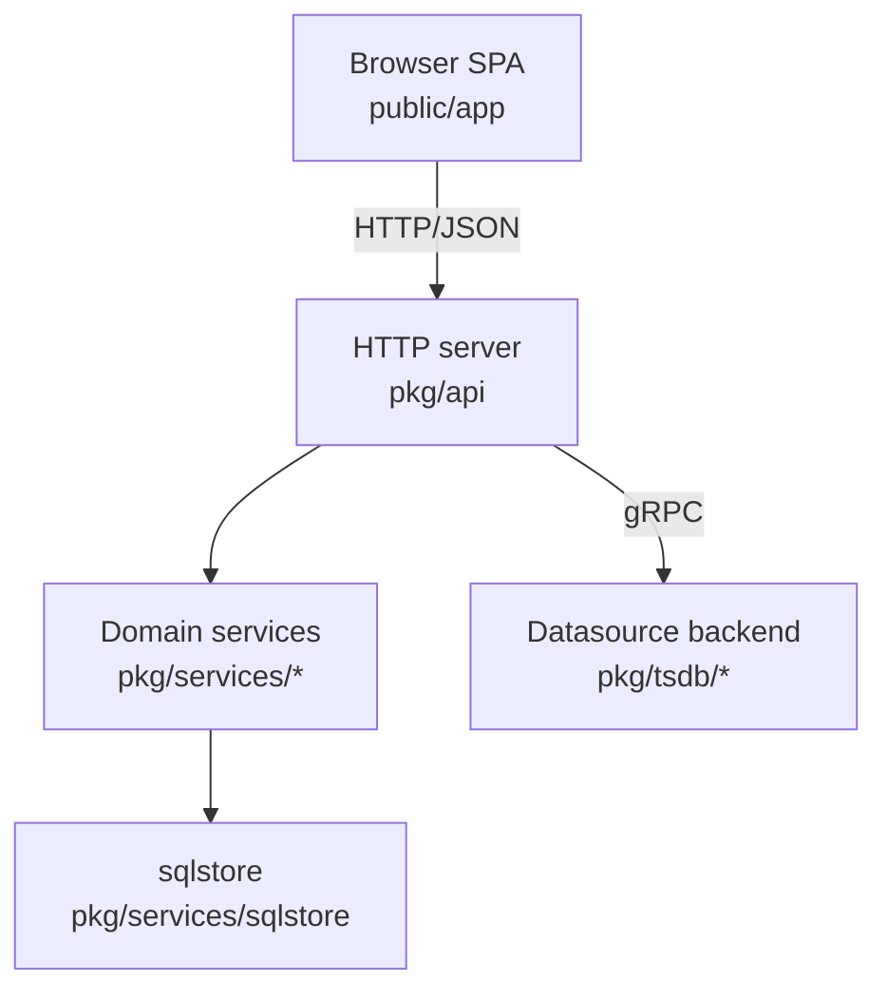

# Template — `overview/architecture.md`

**Purpose:** how the system fits together at runtime and in the tree. This is the
**most diagram-heavy** page. Every node maps to a real directory.

## Skeleton

```markdown
# Architecture

<1 paragraph: the system in one breath — what's a single process vs. many, what
talks to what, what the user hits first.>

## High-level components

<Mermaid diagram: boxes = directories/components, edges = "calls / serves /
proxies". Label edges with the protocol (HTTP/JSON, gRPC, WebSocket).>



<1 line: "Every box maps to a directory in this repo." Then note how they're
wired (DI graph file, mux, subprocess model).>

## <Layer A — e.g. Backend layers>

<Prose + per-layer bullets. For each layer: what it does, where it lives, the
representative files. Use the project's real layering vocabulary.>

## <Layer B — e.g. Frontend layers>

<Second Mermaid diagram if the other half of the system has its own shape.>

## Runtime topology

<What actually runs in a deployment: processes, replicas, databases, subprocesses,
real-time channels. Distinguish "separate deployment" vs "child process".>

## Cross-cutting concerns

- **Configuration** — <how config is parsed, where>. See **Reference / Configuration**.
- **Auth & access control** — <methods, packages>.
- **Feature flags / schema / codegen** — <where defined, how checked>.
```

## Notes

- Aim for **2 diagrams**: one per major subsystem (backend/frontend, or
  compiler/library). Keep node labels to `Name<br/>path/`.
- After each diagram, ground it: "Every box maps to a directory." Name the
  wiring file (e.g. `pkg/server/wire.go` DI graph).
- Sections seen in grafana: High-level components · Backend layers · Frontend
  layers · Apps and unified storage · Plugins and datasources · Runtime topology
  · Cross-cutting concerns. Rust/react use compiler-stage / fiber-pipeline shapes
  instead — mirror the repo's actual architecture, not grafana's.
- Mermaid renders natively (`class="mermaid wiki-mermaid"`), so use real Mermaid
  syntax (`flowchart`, `sequenceDiagram`, etc.).

## Real excerpt (grafana)

> Grafana is a single binary that bundles an HTTP server, a plugin host, and a
> precompiled frontend SPA … the Go server serves the React app on first load and
> then handles JSON/gRPC API calls and proxied datasource queries.
>
> *Backend layers* — a classic three-layer split inside `pkg/`: API handlers in
> `pkg/api/` … services in `pkg/services/<domain>/` … storage in
> `pkg/services/sqlstore/` (xorm-based). Services are wired with Wire DI in
> `pkg/server/wire.go`; the plugin host launches each datasource plugin as a
> separate gRPC subprocess.
